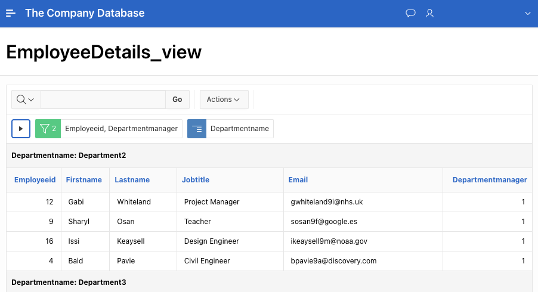

# The Company Database Project

This repository contains the implementation of a company database project deployed on Apex Oracle. The purpose of this project is to practice SQL implementation from end to end, serving as a final assessment for the Databases course in the MS in Computer Science program at the University of Abertay.

## Table of Contents
1. [Overview](#overview)
2. [Database Tables Overview](#database-tables-overview)
3. [Deployment](#deployment)
4. [Instructions](#instructions)
5. [License](#license)
6. [Acknowledgments](#acknowledgments)

## Overview

The project encompasses the following components:

- **Database Model**: The database model includes an Entity-Relationship Diagram (ERD) and a relational model. Please refer to the provided images for the database model.

- **Database Implementation**: The DDL (Data Definition Language) code for implementing the database schema is provided in the repository. The DDL code defines the structure of the database tables, constraints, and relationships necessary for data storage and retrieval.

- **Database Population**: The DML (Data Manipulation Language) code for populating the database with initial data is included in the repository. This code inserts sample data into the database tables to simulate real-world scenarios.

- **Database Queries**: SQL queries and views are provided for querying the database. These queries retrieve specific information from the database tables to answer business questions or generate reports.

- **Front-End Interface**: The database is accessed through a web interface built using Apex Oracle. The web interface provides users with a user-friendly platform to interact with the database and perform various operations.

## Database Tables Overview

1. **Department**:
   - Stores information about departments including department number, name, manager, and manager start/end dates.

2. **Location**:
   - Contains details about department locations with a foreign key constraint referencing the `Department` table.

3. **Employee**:
   - Holds data about employees such as their personal information, job details, department assignment, and supervisor. Also includes foreign key constraints for department and supervisor references.

4. **Dependent**:
   - Records information about employee dependents with a foreign key constraint referencing the `Employee` table.

5. **EmployeeDepartmentHistory**:
   - Tracks the history of employee department transfers.

6. **Project**:
   - Stores project details including department, location, and start date.

7. **Assignment**:
   - Manages employee assignments to projects with hours worked per week.

8. **Customer**:
   - Contains customer data with a foreign key reference to the sales representative (employee).

9. **Product**:
   - Stores information about products.

10. **SalesOrder**:
    - Records sales orders with a foreign key reference to the customer.

11. **OrderDetail**:
    - Contains details of products ordered within each sales order.

12. **Warehouse**:
    - Stores warehouse information with a reference to the location.

13. **Inventory**:
    - Tracks inventory levels for products in each warehouse.

14. **ProductTransfer**:
    - Records transfers of products between warehouses.

## Deployment

The database project is deployed on Apex Oracle, and the web interface can be accessed via the following link: [Test_User](https://apex.oracle.com/pls/apex/r/ear/the-company-database)

Alternativaly, you can deploy your own version by following the instructions below.

## Instructions

To utilize the database project, follow these steps:

1. **Database Setup**: Execute the provided DDL code to create the database schema on your Oracle instance.

2. **Data Population**: Run the DML code to populate the database with sample data.

3. **Querying the Database**: Utilize the provided SQL queries and views to retrieve information from the database as needed.

4. **Interacting with the Web Interface**: Access the web interface via [Apex App Buider](https://apex.oracle.com/en/learn/getting-started/app-builder/) (you can run it from the DDL Script page under SQL Workshop to automatically include all tables).

## License

This project is licensed under the MIT License - see the [LICENSE](LICENSE) file for details.

## Acknowledgments

- This project was completed as part of the Databases course in the MS in Computer Science program at the University of Abertay.

